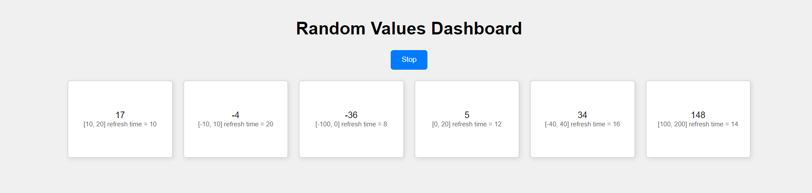

---

# Random Values Dashboard

A simple web-based dashboard built with **Flask** and **HTML** that displays random values in real-time. The values are updated at different intervals and can be stopped with a button on the web page.

## Features

- Real-time display of random values within specified ranges.
- Background threads to update values with varying refresh times.
- A "Stop" button to stop the background processes from updating values.
- Clean and simple user interface.

## Prerequisites

- **Python 3.6+** installed on your system.
- **pip** for managing Python packages.

## Libraries

Make sure you have the following Python libraries installed:

- `Flask` - To create the web server.
- `threading` - To run background tasks.
- `random` - To generate random numbers.

You can install Flask using pip:
```bash
pip install Flask
```

## Project Structure

```
random-dashboard/
├── threading.py
├── app.py                   # Main Flask application
├── templates/
│   └── index.html           # HTML file for the dashboard
```

## Running the Project

Follow these steps to run the project on your local machine:

1. **Clone the Repository:**
   ```bash
   git clone https://github.com/DDev30/Random-Values-Dashboard-Multithreading-.git
   cd random-dashboard
   ```

2. **Install Required Libraries:**
   ```bash
   pip install Flask
   ```

3. **Run the Flask Server:**
   ```bash
   python app.py
   ```

4. **Open the Dashboard:**
   - After running the command, you should see output indicating that the server is running on `http://127.0.0.1:5000/`.
   - Open your web browser and navigate to `http://127.0.0.1:5000/` to view the dashboard.

5. **Stop the Threads:**
   - Click the "Stop" button on the dashboard to stop the random value updates.

## How It Works

- The Flask application (`app.py`) sets up a web server that serves the `index.html` page.
- Random values are generated using Python's `random` module and updated in the background using threads.
- The `index.html` page fetches these values from the server every second using JavaScript and displays them.
- A "Stop" button is provided to stop the background threads by making a `POST` request to the `/stop` endpoint.

## Screenshots

### Dashboard Interface
![Dashboard Interface]

## License

This project is licensed under the MIT License.

---
